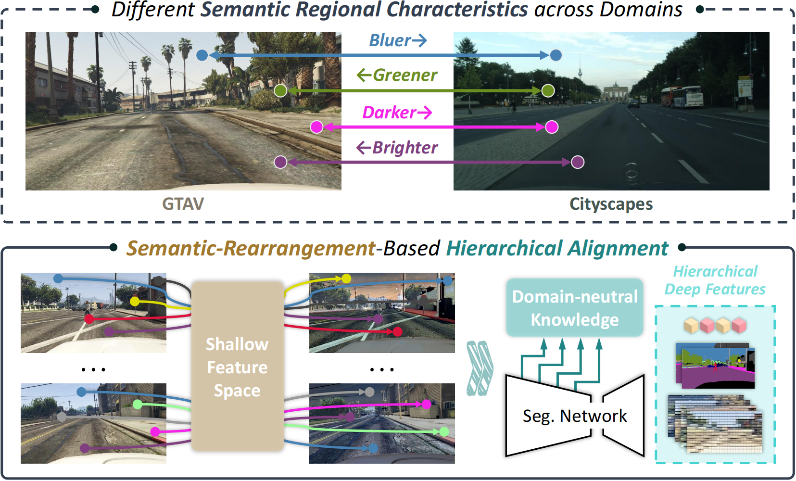

# Semantic-Rearrangement-Based Hierarchical Alignment for Domain Generalized Segmentation

This repository contains the implementation of the paper:

[***Semantic-Rearrangement-Based Hierarchical Alignment for Domain Generalized Segmentation***](https://www.sciencedirect.com/science/article/abs/pii/S0893608025004460)
<br>
<p align="center">
  
</p>

> **Abstract:**
> Domain generalized semantic segmentation is an essential computer vision task, for which models only leverage source data to learn semantic segmentation towards generalizing to the unseen target domains. Previous works typically address this challenge by global style randomization or feature regularization. In this paper, we observe that different local semantic regions exhibit different visual characteristics from the source domain to the target domain. Thus, methods focusing on global operations find it hard to capture such regional discrepancies, failing to construct domain-invariant representations with consistency from the local to global level. Therefore, we propose Semantic-Rearrangement-based Hierarchical Alignment (SRHA) to overcome this problem. SRHA first incorporates a Semantic Rearrangement Module (SRM), with semantic region randomization to sufficiently enhance the diversity of the source domain. A Hierarchical Alignment Constraint (HAC) is subsequently proposed with the help of such diversity to establish the global-regional-local consistent domain-invariant representations. By aligning features across randomized samples with domain-neutral knowledge at multiple levels, SRHA provides a more robust way to handle the source-target domain gap. Extensive experiments indicate the superiority of SRHA over the current state-of-the-art works on various benchmarks.


<!-- ## Pytorch Implementation -->
## Installation
Models in this paper are trained and evaluated on NVIDIA RTX 3090 GPUs.

Please install the following packages. 
```shell
conda create -n srha python=3.8
conda activate srha
conda install pytorch torchvision torchaudio cudatoolkit=11.1 -c pytorch-lts -c nvidia
pip install -r requirements.txt
```
If you want to try our ResNet50-Mask2Former experiment, please additionally install the following packages.
```shell
python -m pip install 'git+https://github.com/facebookresearch/detectron2.git'
cd network/mask2former_head/pixel_decoder/ops
sh make.sh
```

## Data Preparation
We conducted the experiments on five different semantic segmentation datasets including synthetic datasets and real-world datasets: [GTAV](https://download.visinf.tu-darmstadt.de/data/from_games/), [Synthia](https://synthia-dataset.net/downloads/808/), [Cityscapes](https://www.cityscapes-dataset.com/), [BDD-100K](https://bdd-data.berkeley.edu/), and [Mapillary](https://www.mapillary.com/dataset/vistas?pKey=2ix3yvnjy9fwqdzwum3t9g&lat=20&lng=0&z=1.5).

Following RobustNet, we adopt *Class Uniform Sampling* proposed in *Improving Semantic Segmentation via Video Propagation and Label Relaxation* to handle class imbalance problems. 


1. We used [GTAV_Split](https://download.visinf.tu-darmstadt.de/data/from_games/code/read_mapping.zip) to split GTAV dataset into train/val/test set.

```
GTAV
 └ images
 └ labels
```

2. We split [Synthia dataset](http://synthia-dataset.net/download/808/) into train/val set following RobustNet.
```
synthia
 └ RGB
   └ train
   └ val
 └ GT
   └ COLOR
   └ LABELS
```


3. We use "leftImg8bit_trainvaltest.zip" and "gtFine_trainvaltest.zip" in [Cityscapes](https://www.cityscapes-dataset.com/). Please make the directory structures as follows.
```
CityScapes
  └ leftImg8bit_trainvaltest
    └ leftImg8bit
      └ test
      └ train
      └ val
  └ gtFine_trainvaltest
    └ gtFine
      └ test
      └ train
      └ val
```
4. We use "10K Images" and "Segmentation" in [BDD-100K](https://bdd-data.berkeley.edu/). Please make the directory structures as follows.
```
bdd100k
 └ images
   └ test
   └ train
   └ val
 └ labels
   └ train
   └ val
```
5. We use the full [Mapillary Vistas](https://www.mapillary.com/dataset/vistas?pKey=2ix3yvnjy9fwqdzwum3t9g&lat=20&lng=0&z=1.5) dataset. Please make the directory structures as follows.
```
mapillary
 └ testing
   └ images
 └ training
   └ images
   └ labels
 └ validation
   └ images
   └ labels
```

## Run
You should modify the dataset path in **"<path_to_SRHA>/config.py"** according to your settings.
```python
# Cityscapes Dir Location
__C.DATASET.CITYSCAPES_DIR = <YOUR_CITYSCAPES_PATH>
# Mapillary Dataset Dir Location
__C.DATASET.MAPILLARY_DIR = <YOUR_MAPILLARY_PATH>
# GTAV Dataset Dir Location
__C.DATASET.GTAV_DIR = <YOUR_GTAV_PATH>
# BDD-100K Dataset Dir Location
__C.DATASET.BDD_DIR = <YOUR_BDD_PATH>
# Synthia Dataset Dir Location
__C.DATASET.SYNTHIA_DIR = <YOUR_SYNTHIA_PATH>
```

### Train
You can train SRHA using the following commands.
```shell
# Train on GTAV using ResNet-50 backbone, Evaluate on Cityscapes, BDD100K, and Mapillary
CUDA_VISIBLE_DEVICES=0,1 sh scripts/train_r50os16_gtav_srha.sh 

# Train on GTAV using ResNet-101 backbone, Evaluate on Cityscapes, BDD100K, and Mapillary
CUDA_VISIBLE_DEVICES=0,1,2 sh scripts/train_r101os16_gtav_srha.sh 

# Train on GTAV using ShuffleNetV2 backbone, Evaluate on Cityscapes, BDD100K, and Mapillary
CUDA_VISIBLE_DEVICES=0,1 sh scripts/train_shuffle_gtav_srha.sh 

# Train on GTAV using MobileNetV2 backbone, Evaluate on Cityscapes, BDD100K, and Mapillary
CUDA_VISIBLE_DEVICES=0,1 sh scripts/train_mobile_gtav_srha.sh 

# Train on Cityscapes using ResNet-50 backbone, Evaluate on BDD100K, Synthia, and GTAV
CUDA_VISIBLE_DEVICES=0,1 sh scripts/train_r50os16_city_srha.sh 
```

### Test
You can test SRHA using the following commands. The checkpoints of our models evaluated in the paper will be released.
```shell
# Evaluate the model trained using ResNet-50 backbone on Cityscapes, BDD100K, and Mapillary
CUDA_VISIBLE_DEVICES=0 sh scripts/valid_r50os16_gtav.sh <YOUR_CKPT_PATH> 

# Evaluate the model trained using ResNet-101 backbone on Cityscapes, BDD100K, and Mapillary
CUDA_VISIBLE_DEVICES=0 sh scripts/valid_r101os16_gtav.sh <YOUR_CKPT_PATH> 

# Evaluate the model trained using ShuffleNetV2 backbone on Cityscapes, BDD100K, and Mapillary
CUDA_VISIBLE_DEVICES=0 sh scripts/valid_shuffle_gtav.sh <YOUR_CKPT_PATH> 

# Evaluate the model trained using MobileNetV2 backbone on Cityscapes, BDD100K, and Mapillary
CUDA_VISIBLE_DEVICES=0 sh scripts/valid_mobile_gtav.sh <YOUR_CKPT_PATH> 

# Evaluate the model trained using ResNet-50 backbone on BDD100K, Synthia, and GTAV
CUDA_VISIBLE_DEVICES=0 sh scripts/valid_r50os16_city.sh <YOUR_CKPT_PATH> 
```

### ResNet-50 + Mask2Former
You can train and test SRHA with Mask2Former decoder using the following commands.
```shell
# Train on GTAV using ResNet-50 backbone + Mask2Former decoder, Evaluate on Cityscapes, BDD100K, and Mapillary
CUDA_VISIBLE_DEVICES=0,1,2,3 sh scripts/train_r50m2f_gtav_srha.sh 

# Evaluate the model trained using ResNet-50 backbone + Mask2Former decoder on Cityscapes, BDD100K, and Mapillary
CUDA_VISIBLE_DEVICES=0 sh scripts/valid_r50m2f_gtav.sh <YOUR_CKPT_PATH> 
```

## Trained models
Our trained models are released on [Google Drive](https://drive.google.com/drive/folders/1UdV-0lU8GVsST5Nc0D-Z8ktkLv0H9W2W?usp=sharing).


## Acknowledgments
This repository is heavily derived from [RobustNet](https://github.com/shachoi/RobustNet) (CVPR 2021) [[link to license](https://github.com/shachoi/RobustNet/blob/main/LICENSE)].
The implementation of Mask2Former decoder is derived from [Mask2Former](https://github.com/facebookresearch/Mask2Former) (CVPR 2022).
Thanks for their awesome works!
